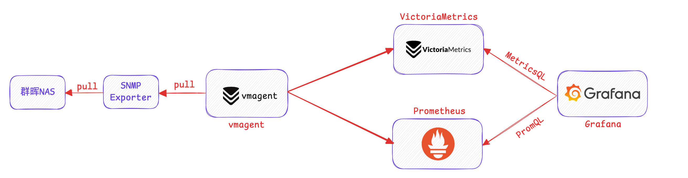
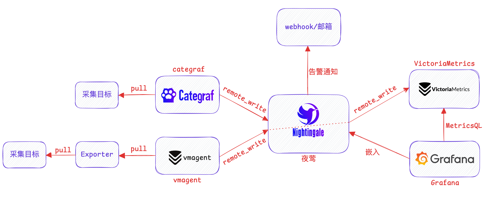
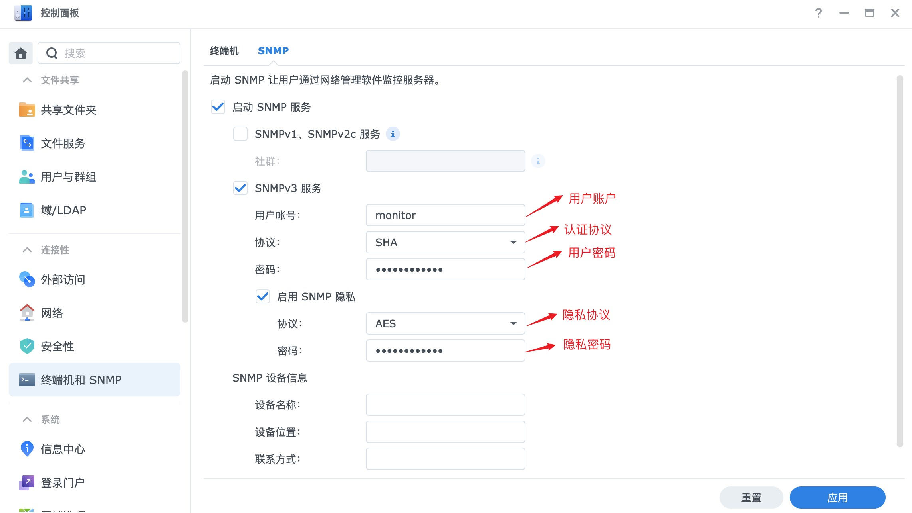
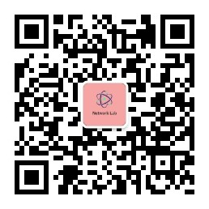

## 群晖 `NAS` 监控
💻📊🔥✅
监控群晖 `NAS`

- 整体监控架构基于 Prometheus 体系
- 指标采集器基于 SNMP Exporter
- 仪表板基于 Grafana

## 监控架构



上图中的架构，采集对象是群晖 `NAS` 采集器使用 SNMP Exporter，基于 vmagent 采集，可以使用的时序库 `Prometheus` 或者 `VictoriaMetrics`，最终使用 `Grafana` 呈现群晖的整体状态。

## 推荐架构



我这边建议使用夜莺生态架构，可以满足绝大部分的场景需求，符合大部分企业对可观测性的要求。

## 该采集如何使用可查看公众号文章

该仪表板主要采集群晖 `NAS` 指标，实现对群晖 `NAS` 各组件和内部信息的监控和告警，这里主要以 `SNMP` 协议开启采集。

## SNMP

以 `SNMP Exporter` 作为采集器，群晖 `NAS` 开启 `SNMP` 服务，这里以 `SNMP v3` 版本为例，需要提前在群晖 NAS 上开启 `SNMP v3`，如下所示：



**Grafana Dashboard ID:  [`21107`](https://grafana.com/grafana/dashboards/21107)**

## 如何采集

- 利用我生成好的配置文件
- 修改 `SNMP` 认证模块参数
- 抓取配置配置好

采集配置文件：[采集配置](snmp/snmp_synology_nas.yml)

修改 `snmp_synology_nas.yml` 文件中的头部认证模块：

```yaml
auths:
  synology_v3:
    community: public
    security_level: authPriv
    username: monitor
    password: Mrot@2024neo
    auth_protocol: SHA
    priv_protocol: AES
    priv_password: Mrot@2024mei
    version: 3
```

在群晖NAS中你配置的 `SNMP v3` 版本的参数在配置文件中修改下，修改完成后，可以直接保存即可，把你的配置文件放到 SNMP Exporter 采集配置中，即可实现采集。

配置抓取任务：

```yaml
scrape_configs:
  - job_name: "synology"
    scrape_interval: 15s
    scrape_timeout: 10s
    file_sd_configs:
      - files:
        - /etc/victoriametrics/vmagent/synology-nas.yml
        # refresh_interval: 2m vmagent 不支持这个参数 prometheus 中可使用这个参数
    relabel_configs:
    - source_labels: ["__address__"]
      target_label: __param_target
    - source_labels: ["__param_target"]
      target_label: instance
    - target_label: __address__
      replacement: 172.17.40.13:9116
    - source_labels: ["module"]
      target_label: __param_module
    - source_labels: ["auth"]
      target_label: __param_auth
      


# /etc/victoriametrics/vmagent/synology-nas.yml
# Prometheus 通过文件发现机制定义的采集目标
- labels:
    module: synology_common,synology_interface
    auth: synology_v3
    brand: Synology
  targets:
    - 172.17.40.140
```

## 更多信息

如果需要了解关于监控的更多信息，还请关注公众号：网络小斐，下面是公众号二维码。

